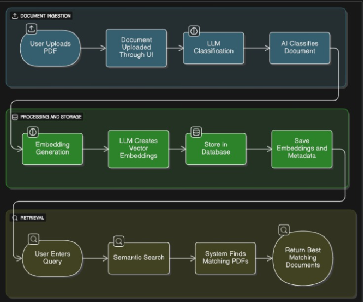

# 📚 DocuMind

DocuMind is an intelligent **document Q\&A assistant** that lets users upload documents, automatically generate summaries, and ask natural language questions about them.
Powered by **Google Gemini AI**, it provides accurate, context-aware answers while maintaining user-specific chat sessions.

## WorkFlow



## 🚀 Features

- 🔐 **User Authentication & Role-Based Access**

  - Secure login using JWT authentication.
  - Supports multiple roles (e.g., Admin, HR, Finance, General User).
  - Role-based access ensures users can only interact with documents and sessions they have permission for.

- 📄 **Document-Centric Chat Sessions**

  - Each chat session is tied to a specific document.
  - Users can create sessions per document, ensuring contextual conversations.
  - Maintains session metadata: creation date, last updated, and owner.

- ✨ **Enhanced Summaries with AI**

  - Summaries of documents are enhanced using Google Gemini API.
  - Provides concise, human-readable summaries for easier Q\&A.
  - Handles missing summaries by extracting text and generating embeddings.

- 🤖 **AI-Powered Q\&A (DocuBot)**

  - Users can ask questions in natural language.
  - Answers are generated based on document summaries or content.
  - Gemini model produces short, precise, human-friendly responses.

- 💬 **Conversation History & Tracking**

  - Stores all interactions in JSON format: user questions and AI responses.
  - Enables users to revisit previous conversations for context.
  - Supports auditing for role-based compliance.

- 🧠 **Semantic Embeddings**

  - Each document is converted into vector embeddings using `sentence-transformers`.
  - Supports semantic search, similarity queries, or context-aware responses.
  - Embeddings are stored per session for fast, temporary retrieval.

- 🌐 **Scalable & Extensible Architecture**

  - Backend built with Django REST Framework for APIs.
  - Frontend React/Next.js integration for real-time chat.
  - Modular design allows adding new AI models, document types, or roles easily.

- 🛡️ **Security & Compliance**

  - All document access is authenticated and logged.
  - Sensitive data never exposed; embeddings stored securely.
  - Supports audit logs for compliance and regulatory needs.

## 🛠️ Tech Stack

- **Backend:** Django + Django REST Framework (DRF)
- **Database:** SQLite (Django ORM)
- **Authentication:** DRF `IsAuthenticated` + Role-Based Permissions (Admin, HR, Finance, General User)
- **AI Model:** Google Gemini 2.5 Flash (for Q\&A & summary enhancement)
- **NLP & Embeddings:**

  - **spaCy** – Named entity recognition and sentence segmentation
  - **Sentence Transformers** (`all-MiniLM-L6-v2`) – Document embeddings for semantic search
  - **Hugging Face Transformers** – Zero-shot classification for categorizing documents

- **Document Formats Supported:** PDF, DOCX, DOC, TXT, CSV
- **Frontend:** Next.js / React with ShadCN UI for chat interface and document preview
- **File Storage:** Local file system or cloud storage (S3 / Cloudinary optional)

### 📂 Document Processing Flow

1. **Upload Document → Detect File Type**
2. **Extract Text → Metadata → Entities → Summary**
3. **Classify Document → Assign Category**
4. **Generate Embedding → Store in DB**
5. **Create Chat Session (Optional) → Assign Session ID & History**

### 1. Clone the repository

```bash
git clone https://github.com/yourusername/docu-mind.git
cd docu-mind
```

### 2. Create and activate a virtual environment

```bash
python -m venv venv
source venv/bin/activate   # On Linux/Mac
venv\Scripts\activate      # On Windows
```

### 3. Install dependencies

```bash
pip install -r requirements.txt
```

### 4. Set up environment variables

Create a `.env` file in the root directory:

```env
SECRET_KEY=your-django-secret-key
DEBUG=True
GOOGLE_API_KEY=your-gemini-api-key
```

### 5. Run database migrations

```bash
python manage.py migrate
```

### 6. Start the development server

```bash
python manage.py runserver
```

---

## 🔑 API Endpoints

### `POST /api/chatbot/create-session/`

Create a new chat session for a document.

**Request body:**

```json
{
  "document_id": "123"
}
```

**Response:**

```json
{
  "session_id": "abcd-efgh-1234",
  "history": []
}
```

---

### `POST /api/chatbot/ask-question/`

Ask a question about the document in a given session.

**Request body:**

```json
{
  "session_id": "abcd-efgh-1234",
  "question": "What are the key points in this document?"
}
```

**Response:**

```json
{
  "answer": "The document explains ...",
  "session_id": "abcd-efgh-1234",
  "history": [
    { "role": "user", "text": "What are the key points in this document?" },
    { "role": "bot", "text": "The document explains ..." }
  ]
}
```

---

## 🤖 How it Works

1. User uploads a document (handled elsewhere in the app).
2. A **chat session** is created and tied to that document.
3. The document’s summary is retrieved.
4. Gemini **enhances the summary** for more context.
5. User asks a question → Gemini answers using the summary.
6. Conversation is saved in **session history**.

---

## 📂 Project Structure (important parts)

```
chatbot/
│── views.py        # API endpoints for Q&A and session creation
│── models.py       # ChatSession model (session, user, history, document link)
│── utils.py        # create_chat_session helper
│── ...
```

---

## ✅ Requirements

- Python 3.9+
- Django 4+
- djangorestframework
- google-generativeai

---

## 🧠 Future Enhancements

- 📤 Upload PDF/docx files directly.
- 🖼️ Support multimodal Q\&A (text + images).
- 🗂️ Better session management (close/archive).
- 📊 Admin dashboard for monitoring usage.

---

## 📜 License

MIT License. Free to use and modify.

---

👉 Do you also want me to include an example `models.py` snippet for **ChatSession** in the README (so new contributors understand how the session and history are structured)?
